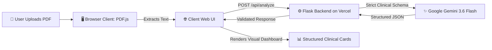

<div align="center">

# 🩺 Medical Report Analyzer

### *Intelligent, Structured Clinical Summaries Powered by Google Gemini*

[](https://python.org)
[](https://flask.palletsprojects.com/)
[](https://ai.google.dev/)
[](https://vercel.com)
[](LICENSE)

<br/>

An end-to-end web application that transforms complex, dense medical lab reports and clinical PDFs into **clean, structured, and plain-language medical intelligence** using Google's state-of-the-art **Gemini 3.6 Flash** model and client-side privacy-first PDF parsing.

[Explore Demo](#-demo) • [Key Features](#-key-features) • [Quick Start](#-quick-start) • [Architecture](#-architecture) • [Deployment](#-cloud-deployment-vercel)

</div>

---

> [!WARNING]
> **Clinical Disclaimer**: This application is strictly an educational and informational tool designed to assist comprehension of medical documentation. It does **not** provide medical diagnoses, treatment plans, or clinical judgements. Always consult a qualified healthcare provider for medical advice.

---

## 🎬 Demo

https://github.com/user-attachments/assets/20ccc0cb-99c8-4a27-ad1a-84dcc2897810

---

## ✨ Key Features

<table>
  <tr>
    <td width="50%">
      <h3>🔒 Privacy-First PDF Parsing</h3>
      <p>Uses <code>pdf.js</code> directly in the client browser to extract selectable text up to 20MB. Raw PDF binaries never touch server storage, protecting sensitive patient records.</p>
    </td>
    <td width="50%">
      <h3>⚡ Google Gemini 3.6 Flash</h3>
      <p>Harnesses Google's latest multimodal LLM with ultra-fast inference and high clinical reasoning accuracy via the official <code>google-genai</code> Python SDK.</p>
    </td>
  </tr>
  <tr>
    <td width="50%">
      <h3>📊 Strict JSON Schema Enforcement</h3>
      <p>Guarantees predictable, strongly-typed JSON output matching clinical taxonomy—eliminating hallucinations, parsing errors, and messy Markdown formatting.</p>
    </td>
    <td width="50%">
      <h3>🧪 Granular Lab Findings Breakdown</h3>
      <p>Automatically isolates laboratory markers, reference ranges, observed values, status flags (<em>normal</em>, <em>abnormal</em>, <em>critical</em>), and plain-language definitions.</p>
    </td>
  </tr>
  <tr>
    <td width="50%">
      <h3>🚨 Urgent Alerts & Action Items</h3>
      <p>Highlights high-priority clinical flags and generates targeted discussion questions for patients to bring to their next clinician appointment.</p>
    </td>
    <td width="50%">
      <h3>☁️ Production-Ready Serverless</h3>
      <p>Pre-configured for Vercel Serverless Functions with tailored 60-second timeouts and automatic fallback handling.</p>
    </td>
  </tr>
</table>

---

## 🏗️ Architecture & Data Flow



---

## 🛠️ Tech Stack

- **AI Model**: [Google Gemini 3.6 Flash](https://ai.google.dev/) via `google-genai` SDK
- **Backend**: Python 3.10+, Flask 3.1, Flask-CORS, python-dotenv
- **Frontend**: Modern Vanilla JS, Semantic HTML5, CSS3 Custom Properties (Dark/Light aesthetic)
- **PDF Engine**: PDF.js (Mozilla) client-side extraction
- **Hosting**: [Vercel](https://vercel.com/) (Serverless Python runtime with `maxDuration: 60s`)

---

## 📁 Repository Structure

```text
Medical-Report-Analyzer/
├── api/
│   └── index.py            # Flask API routes, Gemini SDK client & schema definition
├── templates/
│   └── index.html          # Responsive client application, UI & PDF.js extraction
├── requirements.txt        # Frozen dependencies (google-genai, flask, etc.)
├── vercel.json             # Vercel Serverless Function & routing configuration
├── .env.example            # Sample environment variables template
├── .gitignore              # Ignores .env, virtual environments & runtime logs
├── LICENSE                 # MIT License
└── README.md               # Project documentation
```

---

## 🚀 Quick Start

### Prerequisites
- **Python 3.10+** installed
- A free **Google AI Studio API Key** ([Get one here](https://aistudio.google.com/app/apikey))

### 1. Clone the Repository
```bash
git clone https://github.com/Poovarasan46/Medical-Report-Analyzer.git
cd Medical-Report-Analyzer
```

### 2. Set Up a Virtual Environment
```bash
# Windows (PowerShell)
python -m venv .venv
.venv\Scripts\Activate.ps1

# macOS / Linux
python3 -m venv .venv
source .venv/bin/activate
```

### 3. Install Dependencies
```bash
pip install -r requirements.txt
```

### 4. Configure Environment Variables
Create a `.env` file in the project root:
```env
GEMINI_API_KEY="your-gemini-api-key-here"
GEMINI_MODEL="gemini-3.6-flash"
```

### 5. Run the Server
```bash
python api/index.py
```

Access the application in your browser:
👉 **`http://127.0.0.1:5000`**

---

## ⚙️ Configuration Reference

The application can be configured via environment variables:

| Variable | Required | Default | Description |
| :--- | :---: | :---: | :--- |
| `GEMINI_API_KEY` | **Yes** | — | API key generated from Google AI Studio |
| `GEMINI_MODEL` | No | `gemini-3.6-flash` | The Gemini model identifier |
| `MAX_REPORT_CHARS` | No | `45000` | Safety limit for character length sent to Gemini |
| `GEMINI_MAX_COMPLETION_TOKENS` | No | `8192` | Maximum token limit for structured output response |

---

## ☁️ Cloud Deployment (Vercel)

This repository is pre-configured with `vercel.json` for one-click deployment to Vercel Serverless:

1. Push your code to GitHub.
2. Navigate to [Vercel](https://vercel.com/) and click **Add New** > **Project** > **Import Git Repository**.
3. Under **Settings > Environment Variables**, add:
   - `GEMINI_API_KEY`: *(your Google Gemini API key)*
4. Click **Deploy**.

> [!TIP]
> The included `vercel.json` already sets `maxDuration: 60`, ensuring Vercel gives Gemini sufficient execution time to analyze long medical records without timing out.

---

## 📋 Structured Output Schema

The AI responds with deterministic JSON adhering to this clinical structure:

```json
{
  "summary": {
    "report_type": "Orthopedic Surgical Consultation",
    "overall_assessment": "Post-operative evaluation with stable progression.",
    "confidence": "high",
    "data_quality": "good"
  },
  "patient": { "name": "...", "age": "...", "gender": "..." },
  "provider": { "facility": "...", "clinician": "..." },
  "key_findings": [
    {
      "test_name": "Hemoglobin",
      "value": "13.8",
      "unit": "g/dL",
      "reference_range": "12.0 - 16.0",
      "status": "normal",
      "plain_language_meaning": "Healthy red blood cell count with no signs of anemia."
    }
  ],
  "possible_concerns": [...],
  "recommendations": [...],
  "urgent_flags": [...],
  "follow_up_questions": [...]
}
```

---

## 🤝 Contributing

Contributions are welcome! If you have suggestions or improvements:
1. Fork the Project
2. Create a Feature Branch (`git checkout -b feature/AmazingFeature`)
3. Commit Changes (`git commit -m 'Add AmazingFeature'`)
4. Push to Branch (`git push origin feature/AmazingFeature`)
5. Open a Pull Request

---

## 📄 License

Distributed under the MIT License. See [`LICENSE`](LICENSE) for more information.

---

<div align="center">
  <sub>Built with ❤️ using Google Gemini & Flask</sub>
</div>
